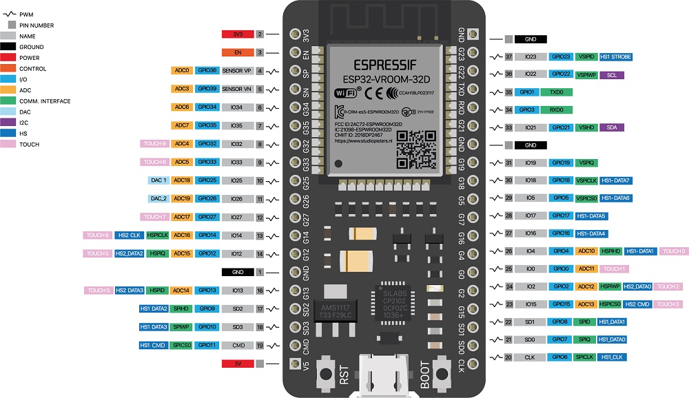
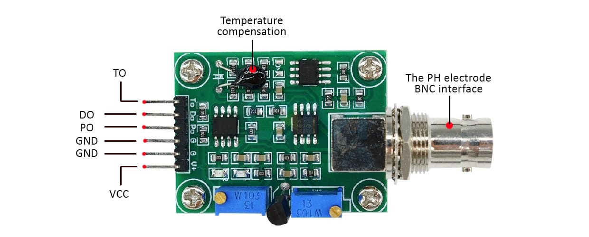
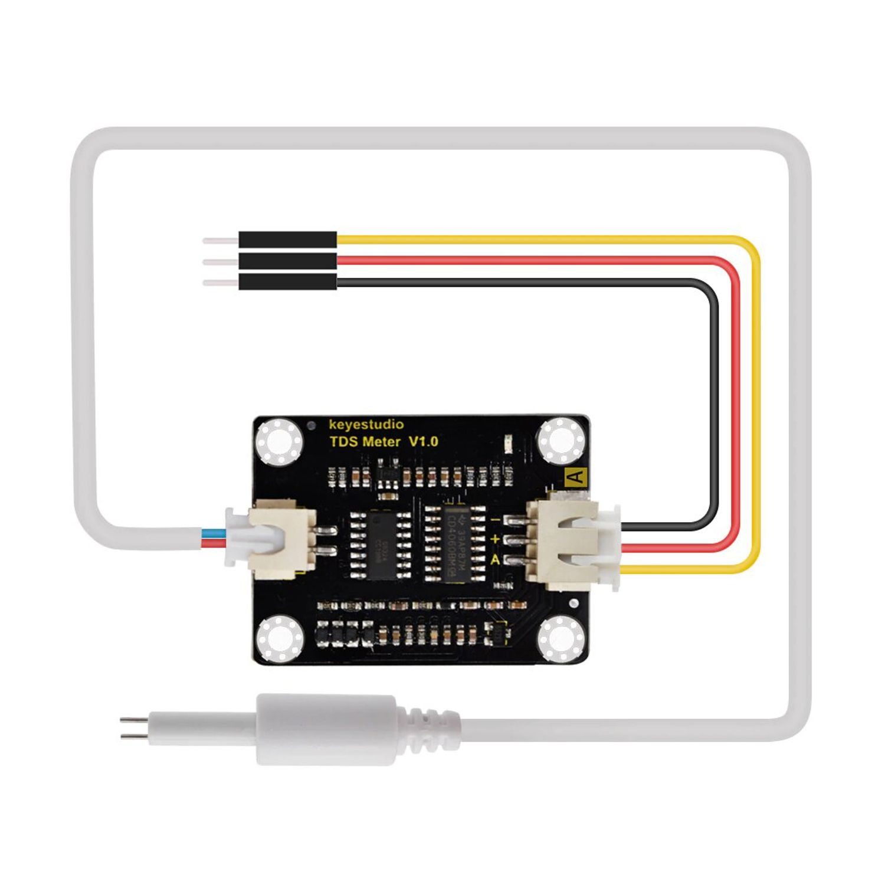
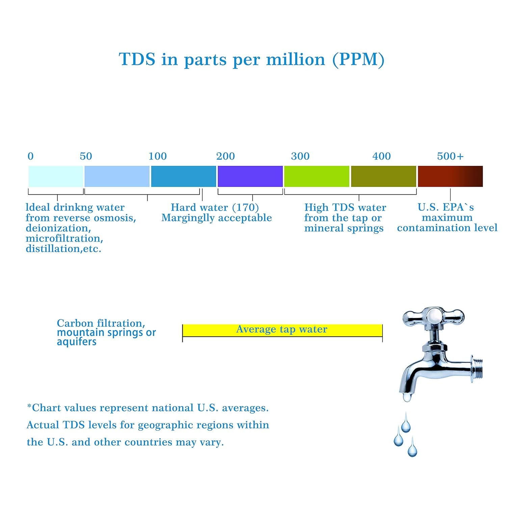
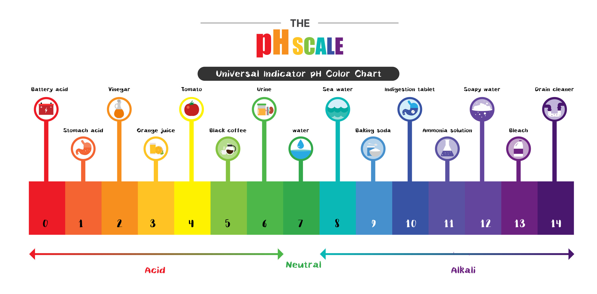

# Controllers
Code for ESP32 microcontroller for measuring TDS and pH level and transfering data via MQTT

# Navigation
- [Setup](#setup)
- [Usage](#usage)
- [Features](#features)
- [Reference](#reference)

# Setup

Main board of the microcontroller:

## setup pH
- VCC - 5V
- GND - GND
- GND - GND
- PO  - G32
- TO  - G33

## setup TDS
- RED    - 3.3V
- BLACK  - GND
- YELLOW - G34

# Usage

1) define all variables in secret.h (localy) \
2) upload **main.cpp** script to ESP32 - by conecting it to micro-usb port and pushing **boot** button
3) connect ESP32 to power - by USB or by battery

# Features

ESP32 after connection to WiFi and MQTT broker will send data in JSON format:

- tag - identification of the device
- time - seconds since launch
- T - temperature [in future]
- TDS - value of particles in the water
- pH - acidity of water

# Reference

