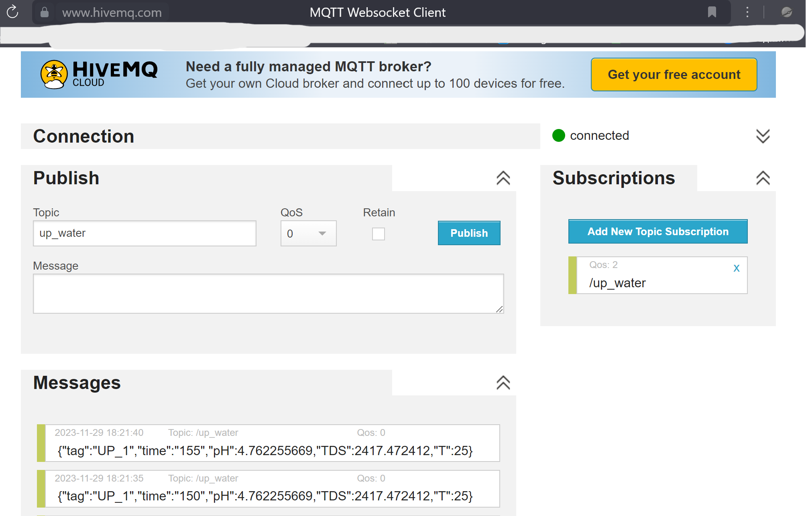
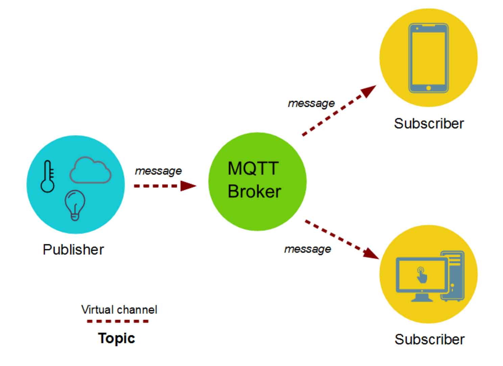

# Working with MQTT broker

## Main usecase

The selected [MQTT broker](https://www.hivemq.com/demos/websocket-client/) is free and open, which means the data stored or collected is available to anyone.

Messages are received in selected topic as JSON stings. 

Dummy data is created as .csv [file](./data/example_data.csv) for testing

## Basic explanation

The Broker stores some of the data for multiple clients, who can publish and subscribe to data. The protocol has multiple levels of message delivery confirmation.

