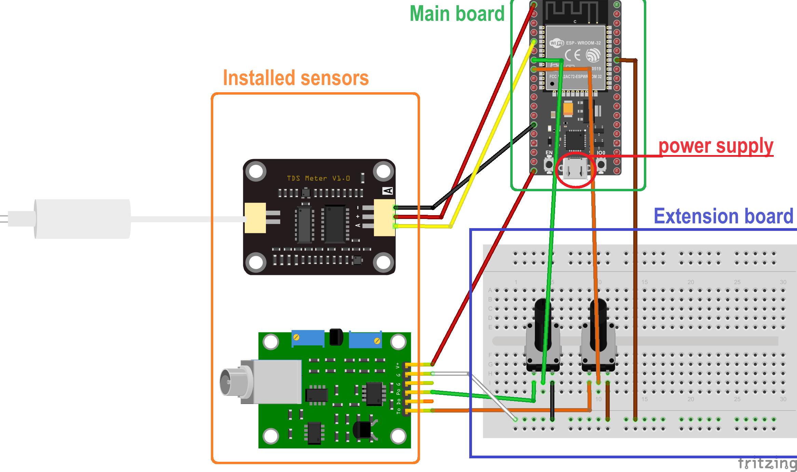
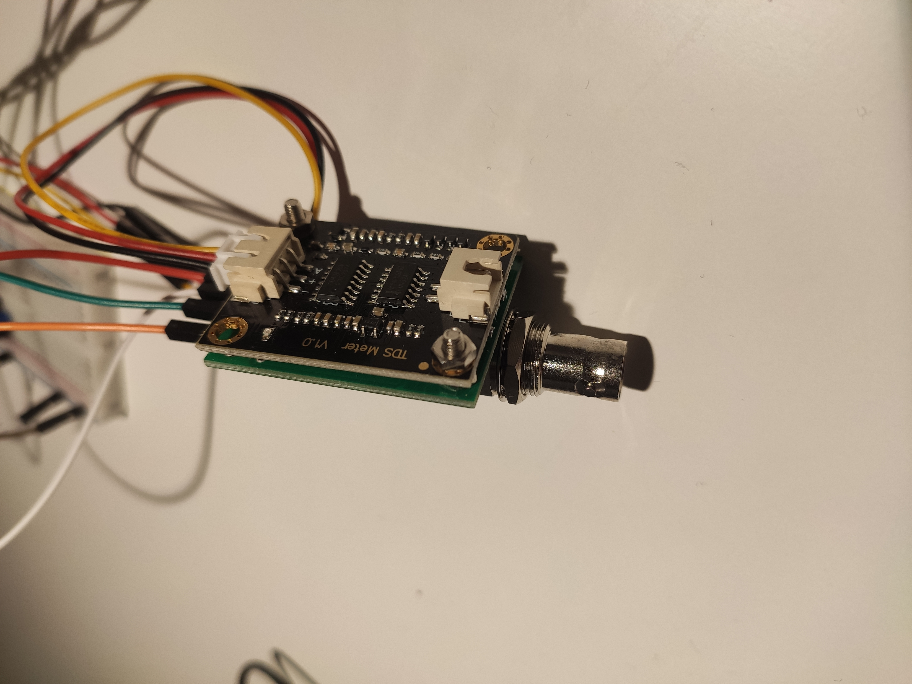

# Wiring tutorial

The whole system could be described in this wiring diagram [[frizing file](./data/esp32_system.fzz)]:

Main board of the microcontroller:

## setup pH
- VCC - 5V
- GND - GND
- GND - GND
- PO  - G32
- TO  - G33

As the cutoff voltage of the ADC in ESP32 is 3.3V, so it requires an extension board to collect the data

Regulated by potentiometers to calibrate the output voltage

### connect the pH probe

For calibration follow the tutorial:
[calibration](https://cimpleo.com/blog/arduino-ph-meter-using-ph-4502c/)

And check the coefficients of linear function using buffer solutions.

## setup TDS
- RED    - 3.3V
- BLACK  - GND
- YELLOW - G34

### connect the TDS probe

